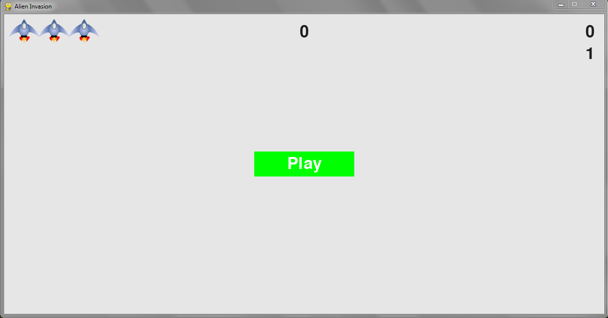
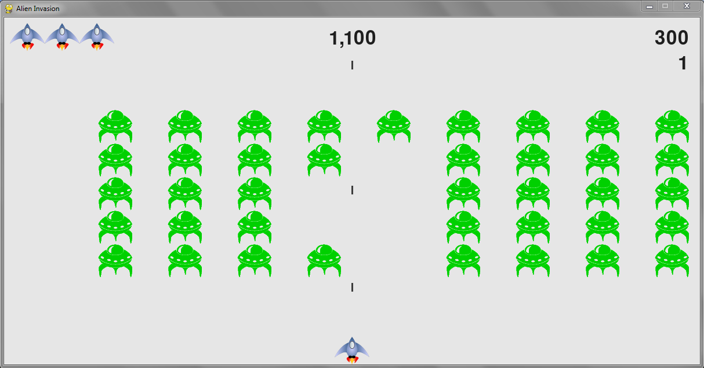
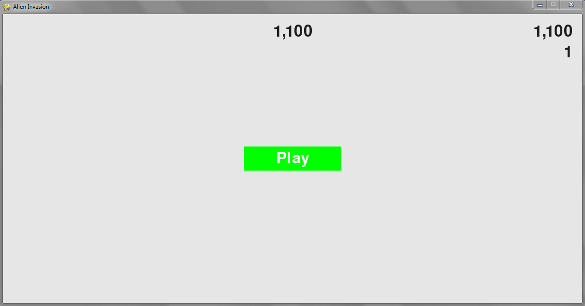

## Alien Invasion

In Alien Invasion, the player controls a ship that appears at the bottom center of the screen. The player can move the ship right and left using the arrow keys and shoot bullets using the spacebar. When the game begins, a fleet of aliens fills the sky and moves across and down the screen. The player shoots and destroys the aliens. If the player shoots all the aliens, a new fleet appears that moves faster than the previous fleet. If any alien hits the player’s ship or reaches the bottom of the screen, the player loses a ship. If the player loses three ships, the game ends.

*-> Created and tested in Windows 7 with python 3.8.6.*

*dependencies:*
* pygame

*command to install pygame after python installation and using windows 7 command line:*
```
> py -m pip install -U pygame --user
```

*run game using windows 7 command line:*
```
> cd alien_invasion && python alien_invasion.py
```

*Note:*
Copied from book Python Crash Course: A Hands-On, Project-Based Introduction to Programming by Eric Matthes (1st Edition - 2015)

## Screenshots




